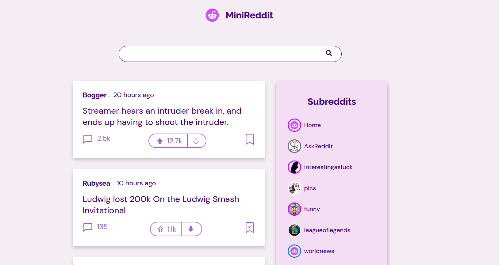

# Mini Reddit

## Description

This is one of projects I created on Codecademy Course

This is the beutiful, light, and simple version of reddit app. Without login to reddit, you can enjoy surfing on reddit posts based on different subreddit categories.

## Features

In this app, you can

- See the latest reddit posts
- Use navigation to move from one subreddit to another
- Use Search Bar to filter the posts
- See the comments from each posts
- Bookmark the posts (still in progress)

## How to Run

For those who just want to enjoy the app, please click [this link](https://mini-reddit-rijalghodi.vercel.app/)
to see the project deployment

For those who want to see the project boilerplate in the local computer, do these:

1. Download this repository
2. Install all the package that listed in requirements section
   - For dependecies package, run `npm install <package-name>`
   - For devDependencies package, run `npm install <package-name> --save-dev`
3. Build the project `npm run build`
4. Run the project `npm start`
5. See the project on `https://localhost:3000`

## Requirements

- dependencies:
  - @reduxjs/toolkit
  - moment
  - react
  - react-dom
  - react-icons
  - react-redux
  - redux
  - redux-thunk
- devDependencies
  - @babel/core
  - @babel/preset-env
  - @babel/preset-react
  - babel-loader
  - css-loader
  - html-webpack-plugin
  - style-loader
  - webpack
  - webpack-cli
  - webpack-dev-server

## Technologies

- ReactJS
- Redux
- Webpack
